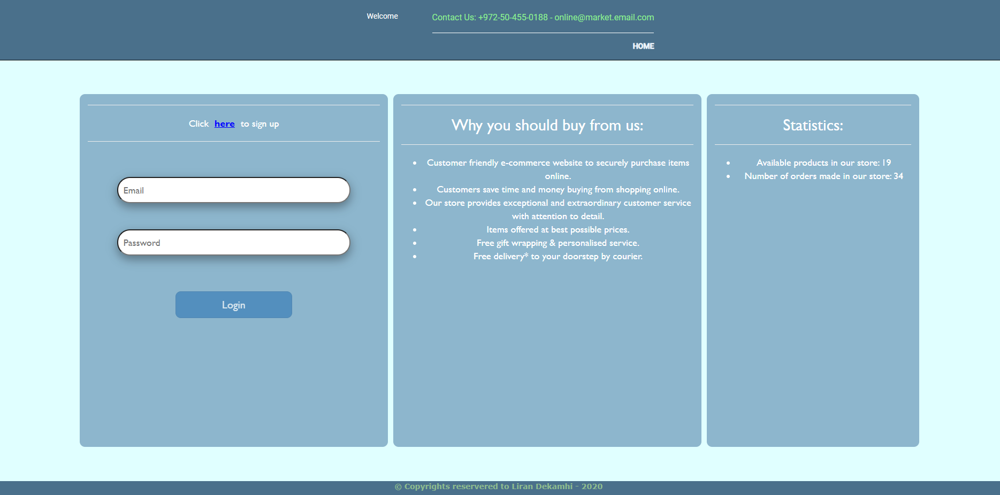
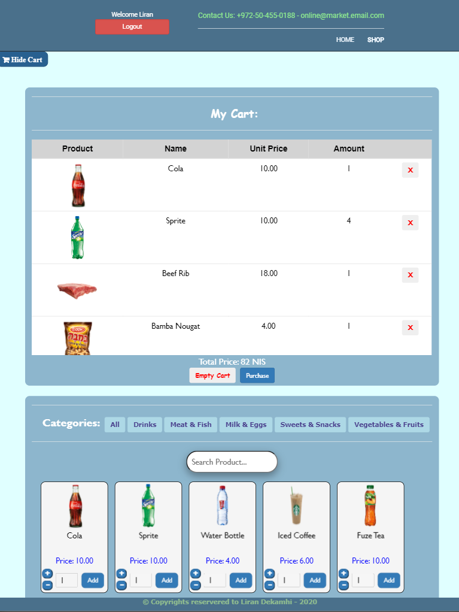
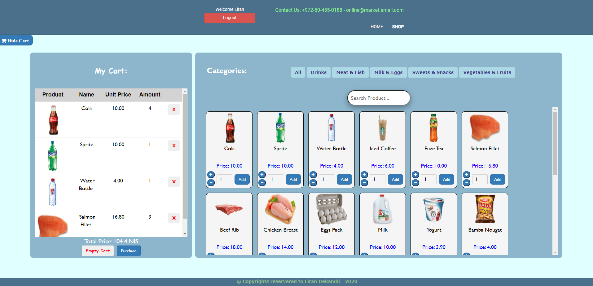
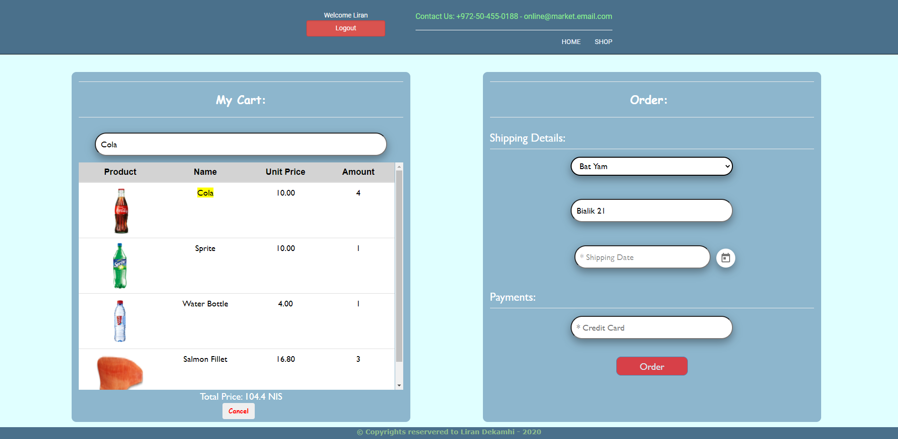
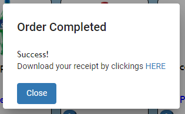
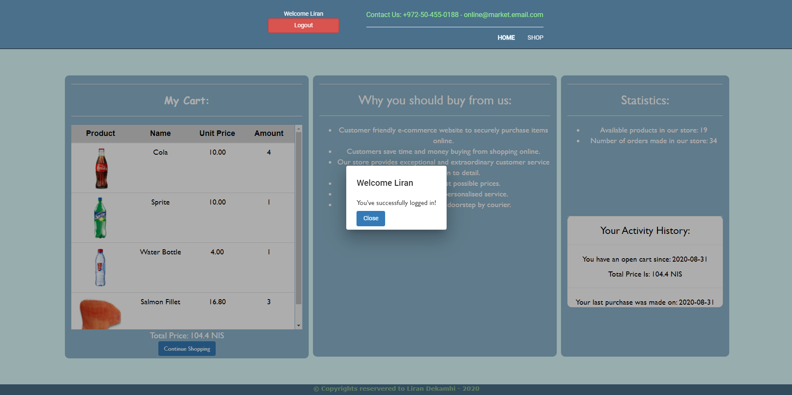
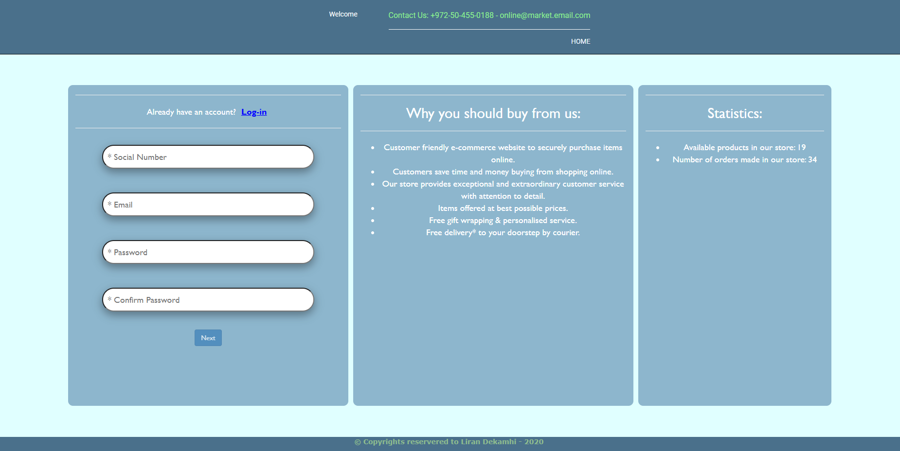
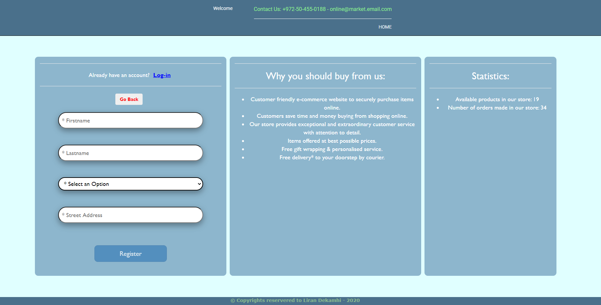
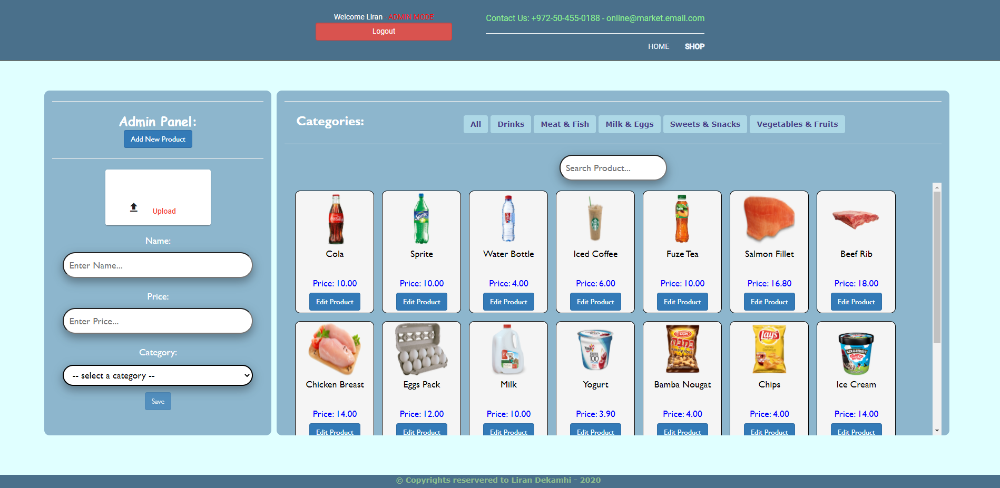

# Online_Store

Online Store for selling groceries using a self-service method.

## Topics:

* HTML + CSS
  - HTML5 Structure
  - Bootstrap design
  
* Angular

* NodeJS
  - Using express
  - Restfull App
  
* MySQL
  - Design & create schema
  - Queries

***

* Log in as Admin:
  - Email: online@market.email.com , Password: 1234

### Home Page:

***

### Mobile Friendly:

***

### Cart and Products:
* The cart can be shown or hidden

***

### Order Page:
* Note that just for demonstration - only 3 orders are allowed per day.

***

### Order Completed / Receipt:

***

### Successful Customer Login:

***

### Register Step One:

***

### Register Step Two

***

### Admin Panel:

